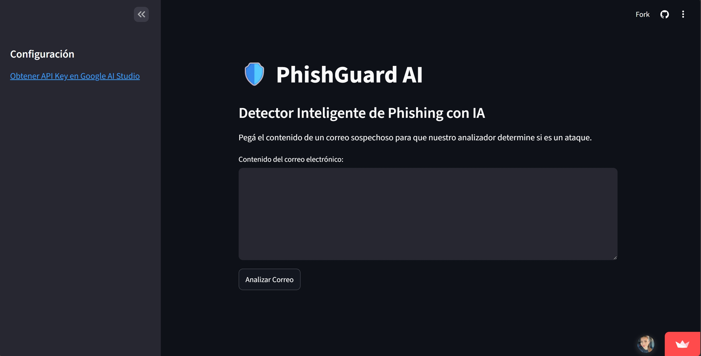
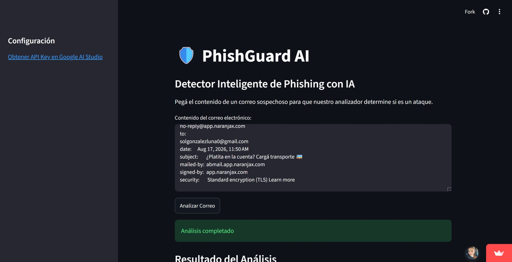
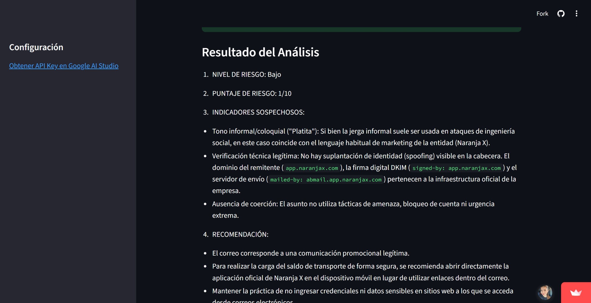

# 🛡️ PhishGuard AI

Detector inteligente de phishing e ingeniería social que analiza el contenido de un correo electrónico y genera un informe de riesgo estructurado, impulsado por la API de Google Gemini.

🚀 **Demo en vivo:** [Probar PhishGuard AI](https://phishguard-ai-lab.streamlit.app/)

> ⚠️ Esta es una demo pública con una cuota de uso compartida (tier gratuito de Gemini). Si no responde, puede estar temporalmente agotada — probá de nuevo más tarde, o cloná el repo y usá tu propia API key.

## ¿Qué hace?

El usuario pega el contenido de un correo sospechoso (remitente, asunto, cuerpo, cabeceras) y la aplicación lo envía a un modelo de lenguaje (Gemini) con un prompt estructurado especializado en detección de phishing e ingeniería social. El resultado es un informe técnico con:

1. **Nivel de riesgo** (Bajo, Medio, Alto o Crítico)
2. **Puntaje de riesgo** (1 a 10)
3. **Indicadores sospechosos** (tácticas de urgencia, suplantación de identidad, enlaces raros, etc.)
4. **Recomendación** de acciones concretas para el usuario

## Cómo funciona

1. El usuario pega el texto del correo en la interfaz de Streamlit.
2. La app construye un prompt estructurado y lo envía a la API de Gemini.
3. Gemini analiza el contenido buscando patrones típicos de ingeniería social (urgencia, suplantación de dominio, tácticas de coerción, etc.).
4. El resultado se muestra en pantalla con formato de informe.

## Stack técnico

- **Python**
- **Streamlit** (interfaz web)
- **Google Gemini API** (análisis del contenido vía prompt engineering)

## Alcance y limitaciones

Este proyecto es un analizador basado en un modelo de lenguaje general (LLM) con un prompt especializado — no es un clasificador de machine learning entrenado específicamente para detección de phishing. Es una herramienta de apoyo y aprendizaje, no un sistema de seguridad certificado para uso en producción.

## Cómo correrlo localmente

\`\`\`bash
git clone https://github.com/solgonzalezluna/Phishguard-ai.git
cd Phishguard-ai
pip install -r requirements.txt
streamlit run app.py
\`\`\`

Necesitás una API Key de Google Gemini ([obtenerla acá](https://aistudio.google.com/)) configurada como variable de entorno `GEMINI_API_KEY` o en `st.secrets`.